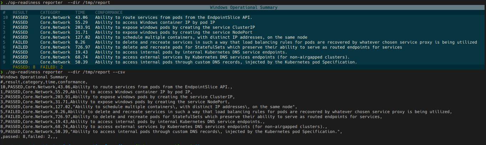

[](https://github.com/kubernetes-sigs/windows-operational-readiness/actions/workflows/tests.yml)
[](https://github.com/kubernetes-sigs/windows-operational-readiness/actions/workflows/golangci-lint.yml)

# Windows Operational Readiness

* [Windows Operational Readiness](#windows-operational-readiness)
    * [Build the project](#build-the-project)
    * [Run the tests](#run-the-tests)
        * [Preliminaries](#preliminaries)
        * [Run the tests using the ops-readiness binary](#run-the-tests-using-the-ops-readiness-binary)
        * [Run the tests as a Sonobuoy plugin](#run-the-tests-as-a-sonobuoy-plugin)
        * [Running on CAPZ upstream](#running-on-capz-upstream)
        * [Customizing the test suite](#customizing-the-test-suite)
        * [Viewing the test output](#viewing-the-test-output)
    * [Community, discussion, contribution, and support](#community-discussion-contribution-and-support)
        * [Code of conduct](#code-of-conduct)

Define an operational readiness standard for Kubernetes clusters supporting Windows that certifies the readiness of
Windows clusters for running production workloads.

Related
KEP: [KEP-2578: Windows Operational Readiness Specification](https://github.com/kubernetes/enhancements/tree/master/keps/sig-windows/2578-windows-conformance)

## Build the project

Building the project will compile the kubernetes e2e binary from source code and also compile
the `windows-operational-readiness` project.

Before building, optionally run clean to ensure the previous build artefacts are cleaned up

```shell
$ make clean
```

Build the project with a specific Kubernetes hash

```shell
$ KUBERNETES_HASH=<Kubernetes commit sha> make build 
```

Build the project with a specific Kubernetes version e.g.

```shell
$ KUBERNETES_VERSION=v1.27.1 make build 
```

Build the project with default Kubernetes version

```shell
$ make build
```

## Run the tests

You can run the tests against the entire test suite, or by specifying a list of categories.
Each test category has test cases that verify the related functionality required for an operational Windows cluster.

The following categories exist.

| Category Name            | Category Description                                                                                                                  |
|--------------------------|---------------------------------------------------------------------------------------------------------------------------------------|
| `Core.Network`           | Tests minimal networking functionality e.g. ability to access pod by pod IP                                                           |
| `Core.Storage`           | Tests minimal storage functionality e.g. ability to mount a hostPath storage volume                                                   |
| `Core.Scheduling`        | Tests minimal scheduling functionality e.g. ability to schedule a pod with CPU limits                                                 |
| `Core.Concurrent`        | Tests minimal concurrent functionality e.g. ability to of node to handle traffic to multiple pods concurrently                        |
| `Extend.HostProcess`     | Tests features related to Windows HostProcess pod functionality.                                                                      |
| `Extend.ActiveDirectory` | Tests features related to Active Directory functionality.                                                                             |
| `Extend.NetworkPolicy`   | Tests features related to Network Policy functionality.                                                                               |
| `Extend.Network`         | Tests advanced networking functionality e.g. ability to support IPv6                                                                  |
| `Extend.Worker`          | Tests features related to windows worker node functionality e.e. ability for nodes to access TCP and UDP services in the same cluster |

You can run the tests in the following ways.

### Preliminaries
1. Build the project 
   - Before running the tests, ensure you have built the project using the previously specified instrunctions regarding how
to [build the project](#build-the-project).
2. Implement a webhook to ensure tests are exclusively scheduled on Windows nodes.
   - For you to reliably target all the Kubernetes e2e tests to be scheduled on a Windows node, you will need to 
set up a [mutating webhook](https://kubernetes.io/docs/reference/access-authn-authz/extensible-admission-controllers/)
which dynamically adds a `kubernetes.io/os:windows` pod selector to every scheduled pod.
[`kubernetes.io/os`](https://kubernetes.io/docs/reference/labels-annotations-taints/#kubernetes-io-os) is a well-known
label which is used to indicate the operating system for the node, so that it can be taken into account by the _kubelet_
and by the _kube-scheduler_.
   - The reason it is necessary to add the webhook is to ensure appropriate and successful scheduling of pods on Windows
     nodes while running the `ops-readiness` tests. Incorrectly scheduling the pods on a different operating system may
     result in false positives or false negatives in the test results. Some Kubernetes e2e tests do not specify a pod
     selector and therefore there can be no guarantee that the pods will be scheduled on Windows node when running
     the `ops-readiness` tests. To reliably run the operational readiness tests on Windows nodes, it is required to
     configure such a webhook.
   - To set up your webhook, you can write your own webhook, or repurpose the one provided in this project.
     See the [webhook README](webhook/README.md) for more instrunctions on how to use the webhook provided in this project.

### Run the tests using the ops-readiness binary

You can run the tests using the following command. This example command will run all the tests in the op-readiness test
suite.

```shell
./op-readiness --provider=<provider> --kubeconfig=<path-to-kubeconfig>
```

If you run the program correctly, you should see output such as the following.

```
Running Operational Readiness Test 1 / 10 : Ability to access Windows container IP by pod IP on Core.Network
...
Running Operational Readiness Test 2 / 10 : Ability to expose windows pods by creating the service ClusterIP on Core.Network
...
```

You can specify the following arguments as part of the command to run the tests.

| Arg            | Description                                                                                                                                       | Default value                                  |
|----------------|---------------------------------------------------------------------------------------------------------------------------------------------------|------------------------------------------------|
| `--kubeconfig` | Path to kubeconfig. Prefer to specify an absolute file path.                                                                                      | Uses location set to `KUBECONFIG` env variable |
| `--provider`   | The name of the Kubernetes provider (e.g. aks, gke, aws, local, skeleton)                                                                         | `local`                                        |
| `--report-dir` | Path to where to dump the JUnit test report.                                                                                                      | Uses location set to `ARTIFACTS` env variable  |  
| `--dry-run`    | Do not run actual tests, used for sanity check.                                                                                                   | `false`                                        |
| `--verbose`    | Enable Ginkgo verbosity.                                                                                                                          | `false`                                        |
| `--category`   | Specify a category with tests you want to run. You can specify multiple categories e.g. `--category=Core.Network --category=Extend.NetworkPolicy` | Empty, will run all tests.                     |
| `--test-dir`   | Path to where to retrieve the test cases from.                                                                                                    | `specifications/`                              |

### Run the tests as a Sonobuoy plugin

We support an OCI image and a Sonobuoy plugin, so you do not need to compile the binary locally.
By default, the latest version of the E2E binary is builtin the image, and if you need to add a custom file
just mount your local version in the plugin at `/app/e2e.test`.

Before running sonobuoy, taint the Windows worker node. Sonobuoy pod should be scheduled on the control plane node:

```shell
kubectl taint node <windows-worker-node> sonobuoy:NoSchedule
```

To run the plugin with the default image:

```shell
make sonobuoy-plugin
```

To retrieve the sonobuoy result:

```shell
make sonobuoy-results
```

The failed results are going to be formatted as follows by default:

```
Plugin: op-readiness
Status: failed
Total: 6965
Passed: 0
Failed: 1
Skipped: 6964

Failed tests:
[sig-network] Netpol NetworkPolicy between server and client should deny ingress from pods on other nam
espaces [Feature:NetworkPolicy]

Run Details:
API Server version: v1.24.0
Node health: 1/1 (100%)
Pods health: 12/20 (60%)
Details for failed pods:
netpol-2630-x/a Ready:: :
netpol-2630-x/c Ready:: :
netpol-2630-y/a Ready:: :
netpol-2630-y/b Ready:: :
netpol-2630-y/c Ready:: :
netpol-2630-z/a Ready:: :
netpol-2630-z/b Ready:: :
netpol-2630-z/c Ready:: :
Errors detected in files:
Errors:
84 podlogs/kube-system/kube-controller-manager-kind-control-plane/logs/kube-controller-manager.txt
51 podlogs/kube-system/kube-scheduler-kind-control-plane/logs/kube-scheduler.txt
47 podlogs/kube-system/kube-apiserver-kind-control-plane/logs/kube-apiserver.txt
10 podlogs/sonobuoy/sonobuoy-op-readiness-job-45e7d10ce5584b90/logs/plugin.txt
 6 podlogs/kube-system/kube-proxy-jdx82/logs/kube-proxy.txt
Warnings:
30 podlogs/kube-system/kube-scheduler-kind-control-plane/logs/kube-scheduler.txt
22 podlogs/kube-system/kube-apiserver-kind-control-plane/logs/kube-apiserver.txt
 7 podlogs/kube-system/kube-controller-manager-kind-control-plane/logs/kube-controller-manager.txt
 2 podlogs/sonobuoy/sonobuoy/logs/kube-sonobuoy.txt
 1 podlogs/kube-system/etcd-kind-control-plane/logs/etcd.txt
 1 podlogs/sonobuoy/sonobuoy-op-readiness-job-45e7d10ce5584b90/logs/plugin.txt
```

To set a particular category, see the `sonobuoy` folder which has a [README](sonobuoy/README.md) detailing how to use
the templates
to render a custom `sonobuoy-plugin.yaml` file.

#### Running on CAPZ upstream

If you want to test your changes on upstream, use the following bot command when opening a new PR:

```shell
/test operational-tests-capz-windows-2019
```

#### Customizing the test suite

You can customize the test suite to specify your own windows cluster's readiness workflows.
You can do this by updating the spec.yaml file under the respective folder in the  `specifications/` folder

#### Viewing the test output

When running your tests, specify the output directory where the test results will be stored using `--report-dir`

```shell
./op-readiness --provider=<provider> --kubeconfig=<kubeconfig> --report-dir report/
```

View the `reporter` using the report subcommand

```shell
./op-readiness reporter --dir ./report/
```

You can also export the test results to a CSV file using the `--csv` flag > filename.csv

```shell
./op-readiness reporter --dir ./report/ --csv
```



## Community, discussion, contribution, and support

Learn how to engage with the Kubernetes community on the [community page](http://kubernetes.io/community/).

You can reach the maintainers of this project at:

- [Slack channel](https://kubernetes.slack.com/messages/sig-windows)
- [Mailing list](https://groups.google.com/g/kubernetes-sig-windows)

### Code of conduct

Participation in the Kubernetes community is governed by the [Kubernetes Code of Conduct](code-of-conduct.md).

[owners]: https://git.k8s.io/community/contributors/guide/owners.md

[Creative Commons 4.0]: https://git.k8s.io/website/LICENSE
